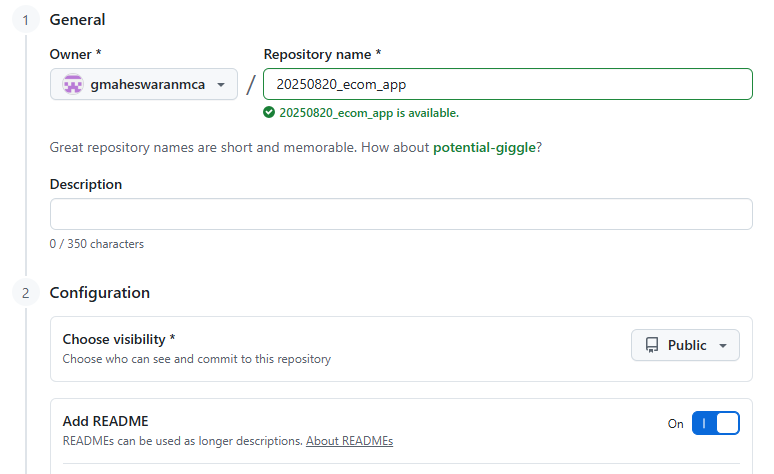
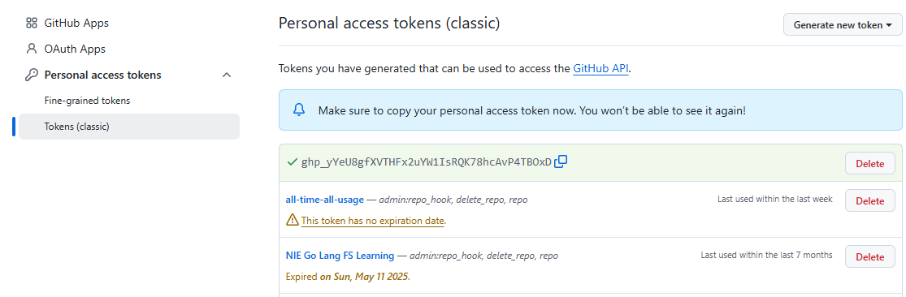

# 🛒 E-Commerce Platform : GitHub, git, Visual Studio Code setup

# 🛠️ Step 1: Create GitHub Repository with `main` Branch and README
1. Go to [GitHub](https://github.com/). 
   - Note that if you do not have GitHub account, create your account with GitHub. 
2. Click **New Repository** → name it: `ecom_app`.
3. Check the option **"Initialize this repository with a README"**.
   * This creates the default `main` branch with a `README.md`.
4. Click **Create Repository**.
### GitHub Repository - Creation Process


# 🔑 Step 2: Generate a Personal Access Token (PAT)
PAT is used for authentication (instead of password).
1. Go to: **GitHub → Settings → Developer settings → Personal access tokens → Tokens (classic)**
   Or: [https://github.com/settings/tokens](https://github.com/settings/tokens)
2. Click **Generate new token (classic)** → Select **repo, workflow** scopes.
3. Copy the token and **save it securely** (you won’t see it again).

👉 Example:
```
ghp_abc123XYZtokenexample
```
---
### GitHub Personal Access Token - Classic - Creation Process

### GitHub Personal Access Token - Classic - Generated Token


# 💻 Step 3: Clone Repository in Windows (Visual Studio Code)
1. Open **Visual Studio Code**.
2. Go to **View → Command Palette (Ctrl+Shift+P)** → type **Git: Clone**.
3. Enter repo URL:
```
https://<token>@github.com/<your-username>/ecom_app.git
```

---
* OR 
---

1. Open **Visual Studio Code**.
2. Go to **View → Command Palette (Ctrl+Shift+P)** → type **Git: Clone**.
3. Enter repo URL:
```
https://github.com/<your-username>/ecom_app.git
```
1. When prompted for authentication, enter:
   * **Username** → your GitHub username
   * **Password** → your Personal Access Token (not your GitHub password)
✔ Repo gets cloned to your Windows machine.
✔ Open the folder in **VSC**.

# 🌿 Step 4: Create Branches (`customer` and `admin`)
You can do this in **VSC Source Control Panel** or in terminal.

### Using VSC Command Palette
1. Open **Command Palette (Ctrl+Shift+P)** → `Git: Create Branch`.
2. Enter `customer` → branch created from `main`.
3. Repeat → create branch `admin`.

### Or in VSC Terminal
```bash
git checkout -b customer   # create & switch to customer
git push origin customer   # push branch to GitHub

git checkout main
git checkout -b admin      # create & switch to admin
git push origin admin
```

# 📘 Step 5: Learning Git Possibilities in VSC
Here’s how you can **practice collaboration workflows** in VSC:

### ✅ Switching Branches
* Command Palette → `Git: Checkout to...` → choose `customer`.

### ✅ Making Changes
* Open `README.md`
* Add:
  ```md
  # Project
  Working on customer feature
  ```
* Save → `Source Control` → **Stage Changes** → **Commit**.

### ✅ Pushing Changes
* Click **Sync Changes** in VSC → pushes to GitHub.

### ✅ Making Changes in github 
* Goto the repo `ecom_app`
* Set brach `customer`
* Open `README.md`
* Add:
  ```md
  # Project
  Working on customer feature

  # Teammate
  Working by teammate on customer branch
  ```
* Save and Commit with message.

### ✅ Pulling Changes
* If teammates push changes, click **Pull** (or use `Git: Pull`).

### ✅ Merging Branches
* Checkout `main` → open Command Palette → `Git: Merge Branch` → choose `customer` branch.
* Commit merge if required.
* Do Sync / Push

### ✅ Making Changes
* Checkout `customer` 
* Open `README.md`
* Add:
  ```md
  # Project
  Working on customer feature
  Yes I started to work

  # Teammate
  Working by teammate on customer branch
  ```
* Save → `Source Control` → **Stage Changes** → **Commit**.

### ✅ Making Changes in github 
* Goto the repo `ecommerce_app`
* Set brach `customer`
* Open `README.md`
* Add:
  ```md
  # Project
  Working on customer feature

  # Teammate
  Working by teammate on customer branch
  One additional changes
  ```
* Save and Commit with message.

### ✅ Pulling Changes
* If teammates push changes, click **Pull** (or use `Git: Pull`).

### ✅ Resolving Merge Conflicts
* If `README.md` was edited in both branches:
  VSC shows **merge markers (`<<<<<<<, =======, >>>>>>>`)**.
* Resolve manually → stage → commit.


